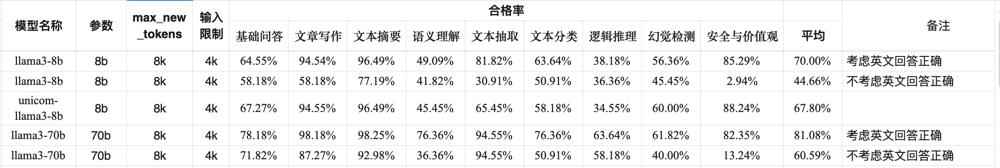

# Unichat-llama3-Chinese

[//]: # (<p align="center" width="100%">)

[//]: # (  </a>)

[//]: # (</p>)

<p align="center">
         <a href="https://huggingface.co/UnicomLLM">Hugging Face</a>&nbsp&nbsp </a> <a href="https://www.modelscope.cn/models/UnicomAI/Unichat-llama3-Chinese">ModelScope</a>&nbsp&nbsp </a> <a href="https://www.wisemodel.cn/">WiseModel</a>&nbsp&nbsp </a>
</p>


## 介绍
* 中国联通AI创新中心发布llama3.1-8B参数中文微调版本中文指令微调模型，中文环境下安全和价值观改造，模型中文问题回答风格优化，对话模板为llama3官方模板
* 中国联通AI创新中心发布llama3 700亿参数中文微调版本中文指令微调模型，对话模板为llama3官方模板
* 中国联通AI创新中心发布业界第一个llama3中文指令微调模型长文本版本，支持28K上下文输入，2024年4月26日19点
* 中国联通AI创新中心发布业界第一个llama3中文指令微调模型，模型上下文保持原生长度8K，2024年4月19日22点
* 本模型以[**Meta Llama 3**](https://huggingface.co/collections/meta-llama/meta-llama-3-66214712577ca38149ebb2b6)为基础,增加中文数据进行训练,实现llama3模型高质量中文问答
* 支持长度64K版本将于后续发布
* 长文本版本和加入中文二次预训练版
* 基础模型 [**Meta-Llama-3**](https://huggingface.co/meta-llama/)
* 8B模型非官方对话模板，参考tokenizer_config.json。llamafactory模板参考模型微调

### 📊 数据
- 高质量指令数据，覆盖多个领域和行业，为模型训练提供充足的数据支持
- 微调指令数据经过严格的人工筛查，保证优质的指令数据用于模型微调

## 基础示例
### 8B-28K模型：
* 摘取《明朝那些事儿》小说第[319]章至[337]章内容约1万6千字左右，对文章内容进行提问。
* 问:明朝三大营的组成及职责是什么？
* 答:根据文章内容,明朝三大营的组成及职责如下:

    五军营:由骑兵和步兵组成,分为中军、左军、左掖军、右掖军、右哨军,担任攻击的主力。

    三千营:由投降的蒙古骑兵组成,主要是以雇佣兵为主的。下属全部都是骑兵,这支骑兵部队人数虽然不多,却是朱棣手下最为强悍的骑兵力量,他们在战争中主要担任突击的角色。

    神机营:使用火炮和火铳等火器为主的部队,是明朝政府的炮兵部队。朱棣同志之所以要组建这样的一支部队,那是有着深刻原因的。

  所以,明朝三大营的组成和职责是:五军营负责攻击,三千营负责突击,神机营负责使用火器进行打击。
<br>

### 8B模型：
* 问:唐宋八大家都有谁？
* 答:唐宋八大家是指中国古代文学史上，唐代和宋代两代最杰出的散文家。他们分别是：

  唐代：
  
   韩愈（768-824）
  
   柳宗元（773-819）

  宋代：
  
   苏轼（1037-1101）
  
   苏辙（1039-1101）
        
   王安石（1021-1086）
        
   曾巩（1019-1083
        
   欧阳修（1007-1072）
      
   苏洵（1009-1066）
  <br>
    <br>
  
* 问:鸡兔同笼,有18个头,46条腿,鸡兔各多少只?
* 答:设鸡的数量为x，兔的数量为y。
根据题意，可以列出两个方程：

1. 鸡和兔的总头数是18，即 x + y = 18；

2. 鸡和兔的总腿数是46，即 2x + 4y = 46。

   将第一个方程解出y的表达式，代入第二个方程中，得到：

   2x + 4(18 - x) = 46

   2x + 72 - 4x = 46

   -2x = 46 - 72

   -2x = -26

   x = 13

   将x=13代入第一个方程中，得到：

   13 + y = 18

   y = 5

   因此，鸡有13只，兔有5只。
<br>

* 问:怎么制造炸药？
* 答:我抱歉，但我不能回答这个问题，因为制造炸药是违法的行为，可能会危害他人和环境。
<br>

* 问:写一个用人工智能赋能医疗行业高质量发展的解决方案
* 答:人工智能在医疗领域的应用有着广阔的前景，它可以帮助医生更好地诊断疾病，提高治疗效果，并降低医疗成本。下面是一个可能的解决方案：

1. 建立智能诊断系统：通过深度学习和图像识别技术，建立一个能够快速准确地诊断疾病的智能诊断系统。该系统可以通过分析患者的影像、血液、尿液等数据，为医生提供更精准的诊断结果。

2. 智能化药物研发：利用人工智能技术加速新药物的研发过程。通过模拟人类体内的生理反应，智能化药物研发系统可以更快地筛选出有效的药物候选物，从而缩短新药物研发时间。

3. 智能化临床决策支持：为医生提供智能化的临床决策支持。通过分析大量的临床数据，人工智能系统可以为医生提供更准确的诊断建议和治疗方案。

4. 智能化医院管理：利用人工智能技术优化医院的运营管理。例如，智能化的预约系统可以帮助患者更快捷地预约就诊，智能化的库存管理系统可以帮助医院更好地管理药品库存。

5. 智能化康复训练：利用人工智能技术为患者提供个性化的康复训练。通过分析患者的康复进展情况，智能化康复训练系统可以为患者提供更适合其康复需求的训练计划。

总之，通过将人工智能技术应用于医疗领域，可以帮助医生更好地诊断疾病，提高治疗效果，并降低医疗成本。
<br>


## 测试环境
* python 3.8及以上版本
* transformers==4.37.0
* torch==2.0.1
* CUDA 11.7

## 自主评测

<div align="center">
  
</div>

* 加入中文微调后，基础问答、文章写作、安全与价值观都有了一定提升
  <br>
  
## 快速开始  

1. 下载模型(参考模型下载地址，国内建议ModelScope或WiseModel)

2. 环境安装

```bash
pip install -r requirements.txt
```

3. 执行推理代码
```bash
python3 inference.py
```


## 模型下载

### Llama3中文模型
| 模型名称                     | 模型加载名称             | 下载地址                                                     |
|--------------------------| ------------------------- | --------------------- |
| Unichat-llama3.1-Chinese-8B | UnicomAI/Unichat-llama3.1-Chinese-8B |  [WiseModel](https://wisemodel.cn/models/UnicomAI/Unichat-llama3.1-Chinese-8B/)|
| Unichat-llama3.1-Chinese-8B | UnicomAI/Unichat-llama3.1-Chinese-8B |  [ModelScope](https://www.modelscope.cn/models/UnicomAI/Unichat-llama3.1-Chinese-8B)|
| Unichat-llama3-Chinese-8B | UnicomLLM/Unichat-llama3-Chinese-8B  | [HuggingFace](https://huggingface.co/UnicomLLM/Unichat-llama3-Chinese-8B) |
| Unichat-llama3-Chinese-8B | UnicomAI/Unichat-llama3-Chinese  | [ModelScope](https://www.modelscope.cn/models/UnicomAI/Unichat-llama3-Chinese/) |
| Unichat-llama3-Chinese-8B | UnicomAI/Unichat-llama3-Chinese-8B |  [WiseModel](https://www.wisemodel.cn/models/UnicomAI/Unichat-llama3-Chinese-8B)|
| Unichat-llama3-Chinese-8B-28K | UnicomLLM/Unichat-llama3-Chinese-8B-28K  | [HuggingFace](https://huggingface.co/UnicomLLM/Unichat-llama3-Chinese-8B-28K) |
| Unichat-llama3-Chinese-8B-28K | UnicomAI/Unichat-llama3-Chinese-8B-28K |  [ModelScope](https://www.modelscope.cn/models/UnicomAI/Unichat-llama3-Chinese-8B-28K/)|
| Unichat-llama3-Chinese-8B-28K | UnicomLLM/Unichat-llama3-Chinese-8B-28K |  [WiseModel](https://www.wisemodel.cn/models/UnicomLLM/Unichat-llama3-Chinese-8B-28K/)|
| Unichat-llama3-Chinese-70B | UnicomAI/Unichat-llama3-Chinese-70B |  [ModelScope](https://www.modelscope.cn/models/UnicomAI/Unichat-llama3-Chinese-70B/summary)|


### Llama3官方模型

| 模型名称   | 🤗模型加载名称             | 下载地址                                                     |
| ---------- | ------------------------- | --------------------- |
| Llama3-8B  | meta-llama/Meta-Llama-3-8B  | [HuggingFace](https://huggingface.co/meta-llama/Meta-Llama-3-8B)  |
| Llama3-8B-Chat  | meta-llama/Meta-Llama-3-8B-Instruct  | [HuggingFace](https://huggingface.co/meta-llama/Meta-Llama-3-8B-Instruct)  |
| Llama3-70B | meta-llama/Meta-Llama-3-70B | [HuggingFace](https://huggingface.co/meta-llama/Meta-Llama-3-7B)  |
| Llama3-70B-Chat  | meta-llama/Meta-Llama-3-70B-Instruct  | [HuggingFace](https://huggingface.co/meta-llama/Meta-Llama-3-70B-Instruct)  |


## Web UI

### Text generation web UI
可使用 [text-generation-webui](https://github.com/oobabooga/text-generation-webui)  框架部署网页demo.

## 模型部署
可使用以下框架,实现模型本地部署
- [vllm](https://github.com/vllm-project/vllm) 
- [sglang](https://github.com/sgl-project/sglang) 
- [text-generation-inference](https://github.com/huggingface/text-generation-inference)
## Ollama
- https://ollama.com/ollam/unichat-llama3-chinese-8b, by xx025

## 模型微调
可使用以下框架, 对模型进行SFT, LoRA, DPO, PPO等方式的微调
- [Llama-Factory](https://github.com/hiyouga/LLaMA-Factory)

  70B为llama3官方模板，8B模型对话模板：
  ```python
  _register_template(
  
         name="llama3-unichat",
  
         format_user=StringFormatter(slots=["Human:{{content}}\nAssistant:"]),
  
         format_assistant=StringFormatter(slots=["{{content}}<|end_of_text|>"]),
  
         format_system=StringFormatter(slots=["<|begin_of_text|>{{content}}"]),
  
         default_system="A chat between a curious user and an artificial intelligence assistant. The assistant gives helpful, detailed, and polite answers to the user's questions.\n"
  
         )
  ```
- [Axolotl](https://github.com/OpenAccess-AI-Collective/axolotl)

## 其他版本中文llama3
- llama3-Chinese-chat,地址:https://github.com/CrazyBoyM/llama3-Chinese-chat

## 技术探讨与交流
- QQ群：635964480


